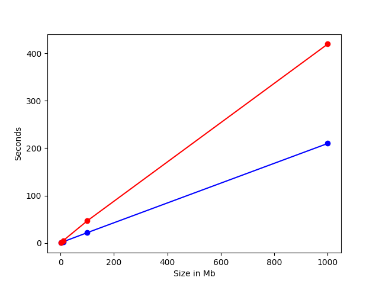

# Звіт до лабораторної роботи №1 (Aes, Kalyna)

- Обрана мова - C++
- IDE - Visual Studio 2019
- OS - Windows 10
# AES
Методи реалізації та імплементації гарно описані в офіціальній документації **[AES Documentation](https://nvlpubs.nist.gov/nistpubs/FIPS/NIST.FIPS.197.pdf)**, тому не бачу сенсу вдаватися в подробиці цього, так як все описано кодом у більш-менш читабельному вигляді. У даному репозиторії для AES ми бачимо папку з source файлами, де лежать відповідні *.h *.cpp файли. 

Реалізація підтримує усі варіанти довжини ключа.
Для користуванням алгоритмом достатньо знати файл, який треба зашифрувати(дешифрувати), ключ і його розмір, далі все виглядає наступним чином:
```sh
std::vector<uint8_t> key =
	{
		0x30, 0x31, 0x32, 0x33, 0x34, 0x35, 0x36, 0x37,
		0x38, 0x39, 0x30, 0x31, 0x32, 0x33, 0x34, 0x35
	};
AES aes(128, key);
aes.Encrypt("../../TestFiles/testFile1Gb.txt", "../../Results/encrypted1Gb.txt");
aes.Decrypt("../../Results/encrypted1Gb.txt", "../../Results/decrypted1Gb.txt");
```

```Encrypt``` та ```Decrypt``` відповідно виконують шифровку та дешифровку файлів. У ф-ціях вище перший аргумент - файл, з якого ми беремо блоки, другий аргумент - файл, в який ми записуємо результат.

Для зберігання та обробки данних усюди використано ```uint8_t``` типа даних, щоб зберігати рівно один байт даних. Для оптимізації можливо було б використати ```uint64_t```, однак наразі не бачу сенсу витрачати час на такі оптимізації.

Список реалізованих для AES методів нижче:
```
private:
    uint8_t xTime(const uint8_t value);
    uint8_t MultBy(const uint8_t input, uint8_t value);
    void LeftShiftColumn(std::vector<uint8_t>& column);
    void SubColumn(std::vector<uint8_t>& column);
        std::vector<uint8_t> GetRConColumn(const int index);
    void XorColumns(std::vector<uint8_t>& first,
	    const std::vector<uint8_t>& second, const std::vector<uint8_t>& third);
    void PushPaddingZeros(std::vector<uint8_t>& msg);

    void SubBytes(std::vector<std::vector<uint8_t>>& state);
    void ShiftRows(std::vector<std::vector<uint8_t>>& state);
    void ShiftRow(std::vector<uint8_t>& row, const int step);
    void MixColumns(std::vector<std::vector<uint8_t>>& state);

    void InvSubBytes(std::vector<std::vector<uint8_t>>& state);
    void InvShiftRows(std::vector<std::vector<uint8_t>>& state);
    void InvShiftRow(std::vector<uint8_t>& row, const int step);
    void InvMixColumns(std::vector<std::vector<uint8_t>>& state);

    void KeyExpansion(const std::vector<uint8_t>& key, std::vector<std::vector<uint8_t>>& res);
    void AddRoundKey(std::vector<std::vector<uint8_t>>& state, const int round);

    void EncryptBlock(std::vector<std::vector<uint8_t>>& input);
    void DecryptBlock(std::vector<std::vector<uint8_t>>& input);
public:
    AES(int keyLen, const std::vector<uint8_t>& key);
    void Encrypt(std::string filePath, std::string outputFilePath);
    void Decrypt(std::string filePath, std::string outputFilePath);
```

Графік швидкості роботи методу на файлах розміром ```1Mb```, ```10Mb```, ```100Mb```, ```1Gb```:
| Size | Time Encryption | Time Decryption |
|------|------|------|
| 1Mb| 0.2 sec| 0.4 sec |
| 10Mb | 2.4 sec| 4.6 sec|
| 100Mb| 21.6 sec| 46.5 sec |
| 1Gb| 210 sec| 415 sec |


# Kalyna
Також існує документація з прикладами роботи, всіми проміжними кроками та необхідною інформацією **[Kalyna Documentation](https://eprint.iacr.org/2015/650)**, тому тут також не бачу сенсу затримуватись на тонкощах реалізації. За необхідне скажу лише, что часу для повного ознайомлення було мало, тому код погано оптимізовано, у результаті чого не всі результати будуть показані.

Дана реалізація також підтримує можливі комбінації параметрів довжини ключа, довжини блока та раундів генерування ключа.

Принцип використання підігнаний під користування попереднім методом:
```
std::vector<uint64_t> key =
	{
		0x0001020304050607, 0x08090A0B0C0D0E0F
	};

Kalyna kalyna(2, 2, key);
kalyna.Encrypt("../../TestFiles/testFile10Mb.txt", "../../Results/kalynaFile10MbEncrypted.txt");
kalyna.Decrypt("../../Results/kalynaFile10MbEncrypted.txt", "../../Results/kalynaFile10MbDecrypted.txt");
```
З єдиною різницею, що у конструктор ми одразу передаємо к-ть стовпців та довжину ключа у більш зрозумілому вигляді. В даному випадку 2 значить, що довжина ключа 128 біт.

Список реалізованих методів:
```
private:
	void SubBytes(std::vector<uint64_t>& state);
	void ShiftRows(std::vector<uint64_t>& state);
	void MixColumns(std::vector<uint64_t>& state);

	void InvSubBytes(std::vector<uint64_t>& state);
	void InvShiftRows(std::vector<uint64_t>& state);
	void InvMixColumns(std::vector<uint64_t>& state);

	uint8_t MultGF(uint8_t f, uint8_t s);
	std::vector<uint64_t> MatrixMult(const std::vector<uint64_t>& first, const std::vector<uint64_t>& second);
	void AddRoundKey(std::vector<uint64_t>& state, const int round);
	void SubRoundKey(std::vector<uint64_t>& state, const int round);
	void AddRoundKeyExpand(std::vector<uint64_t>& state, const std::vector<uint64_t>& values);
	void XorRoundKey(std::vector<uint64_t>& state, const int round);
	void XorRoundKeyExpand(std::vector<uint64_t>& state, const std::vector<uint64_t>& values);
	void Rotate(std::vector<uint64_t>& state);
	void ShiftLeft(std::vector<uint64_t>& state);
	void RotateLeft(std::vector<uint64_t>& state);

	void EncipherRound(std::vector<uint64_t>& state);
	void DecipherRound(std::vector<uint64_t>& state);

	void KeyExpandKt(std::vector<uint64_t>& state, std::vector<uint64_t>& kt);
	void KeyExpandEven(std::vector<uint64_t>& state, std::vector<uint64_t>& kt);
	void KeyExpandOdd();
	void KalynaKeyExpand(std::vector<uint64_t>& state);

	std::vector<uint64_t> KalynaEncipher(std::vector<uint64_t>& input);
	std::vector<uint64_t> KalynaDecipher(std::vector<uint64_t>& input);

public:
	Kalyna(const int blockSize, const int keySize, const std::vector<uint64_t>& key);
	void Encrypt(std::string inputFilePath, std::string outputFilePath);
	void Decrypt(std::string inputFilePath, std::string outputFilePath);
```

Some results:
| Size | Time Encryption | Time Decryption |
|------|------|------|
| 1Mb| 1.4 sec| 1.7 sec |
| 10Mb | 12.7 sec| 12.7 sec|
| 100Mb| 133 sec| 140 sec |
