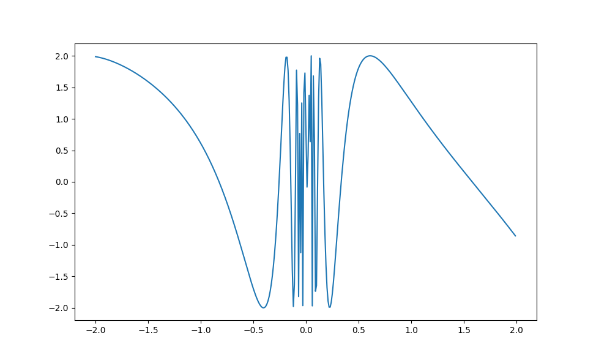

# Звіт до лабораторної роботи №1 (Math expression parser)

- Обрана мова - Python
- IDE - Visual Studio Code
- OS - Windows 10
# Shunting Yard
Основна ідея алгоритму гарно да зрозуміло описана на Вікіпедії (також є псевдокод)  **[Shunting Yard](https://en.wikipedia.org/wiki/Shunting-yard_algorithm)**. У відповідному файли знаходиться реалізація алгоритму у вигляді класу з доступним інтерфейсом для користування. 

Для користування цим класом і наступним достатньо передати в конструктор класу вираз у вигляді `string`, який ми хочемо пропарсити. Приклад: `"sin(pow(2, 3)/3*PI)"`. 

Далі буде створена черга з токенів, яка в собі має пари `(value, typeAsString)`, де замість `type` може бути або число, або функція з дозволенних. `typeAsString` може бути: `number`, `variable`, `function`, `operator`, `leftParenthesis`, `rightParenthesis`. Всі значення для змінних та констант переходять у вихідну чергу у вигляді пари `(value, "number")`. Після цього, використовуючи `getValue()` функцію, що парсить вихідну чергу, отримуємо значення для відповідної змінної або набору змінних. 

# Straight parsing

Данний алгоритм парсить вхідну строку посимвольно, ідучи наступною логікою: `Addition`, `Multiplication`, `Brackets`, `NegativeValue`, в результаті чого парсимо число, функцію, змінну або константу, і результат повертаємо вгору по черзі виклику. У випадку функції окремо парсимо аргументи, де також перевіряємо наявність `(` та `)`.

Результат отримуємо аналогічно першому алгоритму, викликаючи метод `getValue()`, куди передаємо значення змінних. 

# Comparing

Порівняно з прямим алгоритмом, `Shunting Yard` не підтримує операцію унарного мінуса, однак являється більш зрозумілим під час реалізації. Асимптотика `Shunting Yard` - `O(n)`, де `n` - кількість токенів. Для прямого алгоритму асимптотика та сама, однак `n` в даному випадку - кількість символів у виразі, що ми парсимо.

# Examples and result plots

Повний приклад для візуалізації функції:

```sh
parser = ShuntingYardParser("2*sin(1/(exp(3*x)+1)-tg(x+PI/2))")
Xs = np.arange(-2, 2, 0.01)
Ys = [parser.getValue({'x': x}) for x in Xs]

plt.plot(Xs, Ys)
plt.show()
```

В результаті чого отримуємо:



